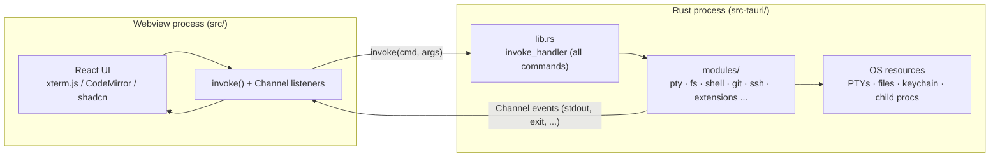

# Architecture

A one-page map of how TEDI fits together, written for a developer reading the
codebase for the first time. For the exhaustive per-module, per-file reference
(every Tauri command, every gotcha, every platform branch) see
[TEDI.md](TEDI.md). For how to build, test, and open a PR see
[CONTRIBUTING.md](CONTRIBUTING.md).

## The big picture: a two-process app

TEDI is a [Tauri 2](https://tauri.app) desktop app. There are two halves:

- **Frontend** (`src/`) - a React 19 + TypeScript app rendered in a webview
  (xterm.js terminals, CodeMirror 6 editor, shadcn/ui). It owns all UI and
  state but **never touches the OS directly**.
- **Backend** (`src-tauri/`) - a Rust process that owns every OS resource: PTYs,
  the filesystem, git, SSH, the keychain, child processes.

The webview reaches the OS only by calling `invoke("command_name", args)`, which
runs a `#[tauri::command]` function in Rust. Long-lived output (terminal bytes,
SSH events) streams back the other way over a Tauri `Channel`. Every command is
registered in one place: the `invoke_handler` block in
[`src-tauri/src/lib.rs`](src-tauri/src/lib.rs). If you want to see the entire
backend API surface, that one file is the index.



There are actually **two webviews**: the main window and a separate **Settings
window** (entry [`src/settings/main.tsx`](src/settings/main.tsx), opened by the
`open_settings_window` command). They share persisted state through
`tauri-plugin-store`, not through React, so any store the main window reads must
be hydrated in both. This is why there are two similarly-named folders, which
trip up newcomers:

| Folder                  | Role                                                                        |
| ----------------------- | --------------------------------------------------------------------------- |
| `src/settings/`         | The Settings **UI** (a separate webview).                                   |
| `src/modules/settings/` | The settings **state layer** (store + preferences) read by the main window. |

## Repo layout at a glance

```
src/                     Frontend (React webview)
  main.tsx               Main-window entry  -> app/App
  app/App.tsx            Top-level coordinator: cross-module wiring, not feature logic
  settings/              Settings UI (separate webview, entry settings/main.tsx)
  components/            shadcn/ui + Vercel AI Elements (generated; don't hand-edit)
  lib/                   Shared helpers (cn(), path utils, ...)
  styles/                Global CSS / theme tokens
  modules/<area>/        Self-contained features (see table below)

src-tauri/               Backend (Rust)
  src/lib.rs             Registers every #[tauri::command] + app boot/CLI dispatch
  src/modules/           pty, pty_daemon, fs, shell, git, ssh, extensions (folders)
                         + cli.rs, cli_ext.rs, cli_theme.rs, cli_update.rs,
                           format.rs, preview.rs, secrets.rs, net.rs (flat files)
  tedi-cli/              Windows console-subsystem `tedi` launcher (separate crate)
  capabilities/          Allowlist of plugin APIs exposed to the webview
```

### Frontend modules (`src/modules/`)

Each module is self-contained and imported through the `@/*` alias only (never a
relative path across modules - a guard, `scripts/check-imports.mjs`, enforces
this). Most expose a thin `index.ts` barrel.

| Module        | Role                                                                         |
| ------------- | ---------------------------------------------------------------------------- |
| `terminal/`   | xterm.js sessions, PTY bridge, OSC 7/133 shell-integration handlers          |
| `editor/`     | CodeMirror 6 stack, language modes, format-on-save, AI autocomplete          |
| `explorer/`   | File tree, icons, fuzzy search, inline rename                                |
| `panes/`      | Split-pane orchestration (horizontal/vertical)                               |
| `tabs/`       | Tab model (terminal / editor / preview / ai-diff) - source of truth for tabs |
| `workspaces/` | Workspace persistence + switching (tab layout + cwd)                         |
| `header/`     | Top bar + inline search + window controls                                    |
| `statusbar/`  | Bottom bar, cwd breadcrumb, AI tools indicator                               |
| `shortcuts/`  | Keymap registry + global shortcut dispatch                                   |
| `settings/`   | Shared settings store + preferences (state layer)                            |
| `theme/`      | `next-themes` provider                                                       |
| `ai/`         | The AI agent subsystem (see below) - the largest module                      |
| `scm/`        | Source-control panel + diffs (frontend for the Rust `git_*` commands)        |
| `ssh/`        | SSH connection manager + remote SFTP explorer                                |
| `preview/`    | Auto-detected dev-server preview tab                                         |
| `scheduler/`  | In-conversation task/timer surface used by the AI agent                      |
| `updater/`    | In-app updater UI on top of `tauri-plugin-updater`                           |
| `extensions/` | Third-party extension host (install, permission-gated host API)              |

### The AI subsystem (`src/modules/ai/`)

BYOK (bring-your-own-key), multi-provider. The layering:

- `config.ts` - the provider + model registry (`PROVIDERS`, `MODELS`). **Add new
  providers here.**
- `lib/` - the engine: `agent.ts` (the AI SDK agent), `transport.ts`,
  `composer.tsx` (input state), `sessions.ts`, plus history `compact.ts` /
  `checkpoint.ts` / prompt `cache.ts`, and `security.ts` (the secret-path
  deny-list).
- `tools/` - the agent's tool definitions (see the table in
  [TEDI.md](TEDI.md#tools-tools)). Read-only tools auto-run; mutating tools are
  approval-gated.
- `store/`, `hooks/`, `components/`, `agents/` - state, React glue, UI, subagents.

Keys are stored only in the OS keychain via the Rust `secrets_*` commands; they
never touch disk, the settings store, or `localStorage`.

## End-to-end walkthroughs

The fastest way to build a mental model is to follow one user action through
every layer. Three representative traces:

### 1. Typing `ls` in a terminal

1. xterm.js captures the keystrokes; `terminal/lib/useTerminalSession` +
   `pty-bridge` forward them via `invoke("pty_write", { id, data })`.
2. Rust `modules/pty/session.rs` writes to the `portable-pty` master fd.
3. The shell runs `ls`; its stdout is read by a backend reader thread and pushed
   to the webview as `PtyEvent` messages over a Tauri `Channel`.
4. `terminal/lib/osc-handlers.ts` parses any OSC 7 (cwd) / OSC 133 (prompt
   markers) escape codes; the raw bytes are written into the xterm buffer.

### 2. Opening a file from the explorer

1. A click in `explorer/` calls `invoke("fs_read_file", { path })`.
2. Rust `modules/fs/file.rs` reads the file (large files stream a line range via
   `fs_read_file_portion`) and returns the contents.
3. `tabs/` opens an `editor` tab; `editor/EditorPane` mounts a CodeMirror view,
   picks the language mode from the extension, and wires format-on-save.

### 3. Asking the AI to edit a file

1. The composer submits to `ai/lib/agent.ts` (an AI SDK `Experimental_Agent`),
   which streams the model's tool calls.
2. The model calls the approval-gated `edit` / `write_file` tool. The agent
   pauses and the UI renders an approval card.
3. The proposed change opens in a side-by-side **`ai-diff`** tab
   ([`editor/AiDiffPane.tsx`](src/modules/editor/AiDiffPane.tsx)); the user
   accepts or rejects per hunk **before** any write happens.
4. On accept, the tool runs `invoke("fs_write_file", ...)`; Rust `modules/fs/`
   performs the write (after the `security.ts` deny-list check).

## Where to go next

- **The exhaustive reference:** [TEDI.md](TEDI.md) - every command, every module,
  every platform-specific gotcha, the PTY daemon, the updater, the extension
  host, formatters, and the CLI entry points.
- **Contributing:** [CONTRIBUTING.md](CONTRIBUTING.md) - build/test commands,
  branch and commit conventions, and what gets merged vs. bounced.
- **Extensions:** [extensions/README.md](extensions/README.md) - the manifest
  schema and host-API reference for writing a third-party extension.
