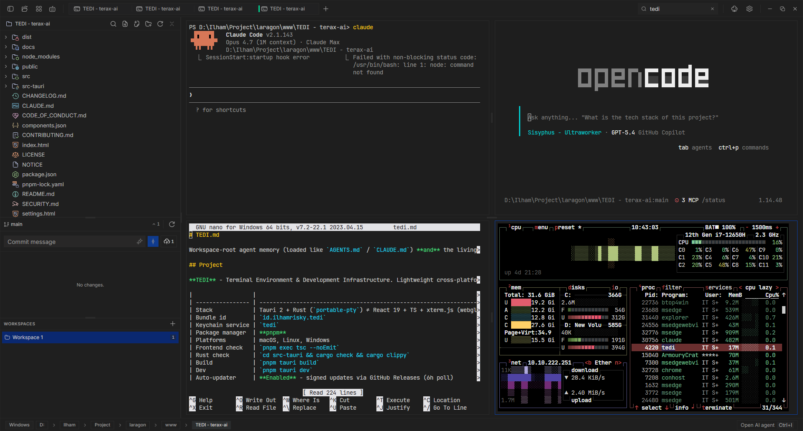
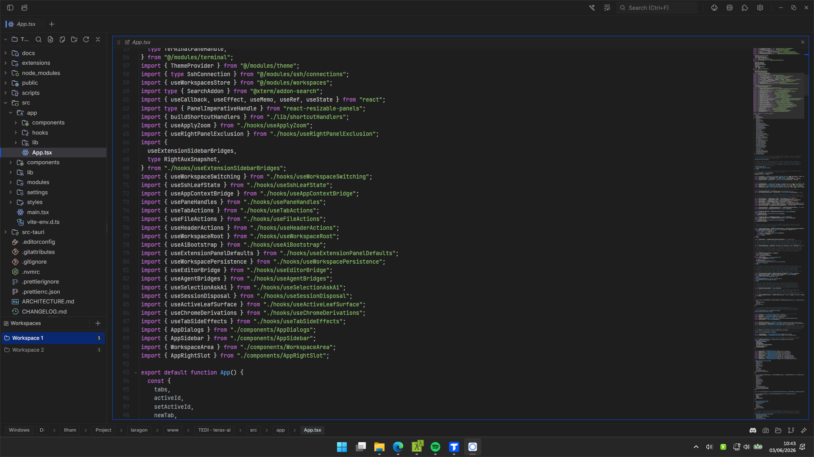
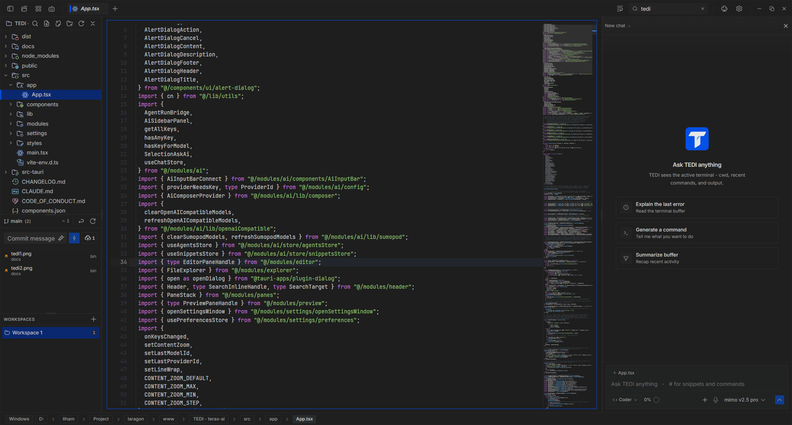
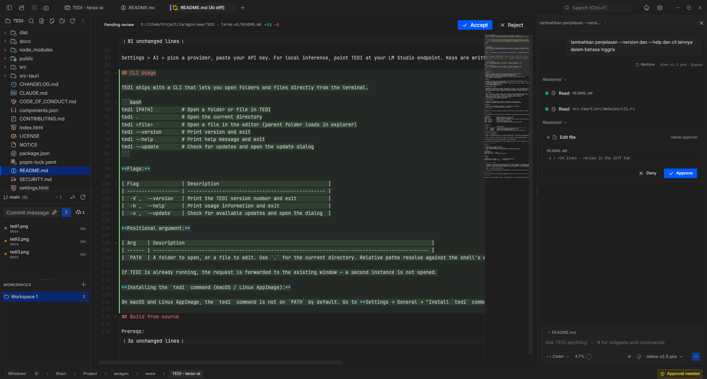

<div align="center">
  
  <h1>TEDI</h1>

  <p><strong>Terminal Environment & Development Infrastructure. Fork of <a href="https://github.com/crynta/terax-ai">Terax</a>.</strong></p>

  <p>
    
    
    
  </p>
</div>

---

> [!IMPORTANT]
> **Built on top of [Terax v0.5.9](https://github.com/crynta/terax-ai/releases/tag/v0.5.9) by [Crynta](https://github.com/crynta).**
> Full credit to the upstream authors for the Rust PTY backend, the React + xterm.js client, and the AI agent core. TEDI keeps the same Apache-2.0 license and tracks its own roadmap onward. Please star the upstream repo if you find TEDI useful.

> Auto-update is **enabled**: TEDI checks [GitHub Releases](https://github.com/IlhamriSKY/TEDI/releases) every 6 hours and offers signed in-app updates. First install is still manual - grab a build from Releases.

## What is TEDI?

**TEDI** (**T**erminal **E**nvironment & **D**evelopment **I**nfrastructure) is a lightweight, low-footprint terminal that boosts developer productivity. Split-screen terminals, tab grouping, and workspaces - designed for developer workflows.

## Install

Pre-built binaries: **[Releases](https://github.com/IlhamriSKY/TEDI/releases/latest)**.

Windows, macOS, and Linux (`.deb`, `.rpm`, `.AppImage`). Download the artifact for your OS and install. Re-download from Releases when a new version drops or check at settings.

## Screenshots

<p align="center">
  
  
</p>
<p align="center">
  
  
</p>

## Features

**Terminal**
- xterm.js + WebGL, multi-tab, background-streaming inactive tabs
- Native PTY via `portable-pty` (zsh, bash, fish, pwsh)
- Shell integration: cwd + prompt markers via OSC 7 / 133
- Spawn new tabs *from inside* a shell instead of popping an external `cmd.exe` / `gnome-terminal` (OSC 8889 + `tedi_open`)
- Split panes: horizontal and vertical, mix terminals and editors freely
- Inline search, link detection, true-color

**Editor**
- CodeMirror 6 with TS/JS, Rust, Python, PHP, HTML/CSS, JSON, Markdown, C/C++, Java, C#
- Inline AI autocomplete and diff-based edit approvals
- Vim mode and themes (Tokyo Night, Nord, GitHub, Atom One, Aura, Copilot, Xcode)
- Inline image preview tab
- Side-by-side Markdown preview

**Workspaces & Tabs**
- Workspaces keep distinct project sessions (tab layout + cwd) and switch without re-opening folders
- Open-folder picker in the header auto-spawns a terminal at the picked root
- Sortable, drag-to-reorder, pinnable tabs across terminal / editor / preview / AI-diff kinds

**AI (BYOK)**
- OpenAI, Anthropic, Google, Groq, xAI, Cerebras, OpenAI-compatible (LM Studio for offline)
- Voice input, multi-agent / sub-agents, snippets, custom system prompt
- Tools: read / write / grep / glob / shell with explicit approval
- Project memory via `TEDI.md` at workspace root
- Tool-routing and approval-flow polish

**File Explorer**
- Catppuccin / Material icon theme, fuzzy search, inline rename
- "Reveal in terminal" opens a new tab rooted at the picked folder

**Quality**
- Apache-2.0, no telemetry, API keys in OS keychain (`keyring`)
- Small bundle (~7-10 MB depending on platform)

## Configure AI

Settings > AI > pick a provider, paste your API key. For local inference, point TEDI at your LM Studio endpoint. Keys are written to the OS keychain via `keyring`. They never touch disk or `localStorage`.

## Build from source

Prereqs:
- Rust stable: https://rustup.rs
- Node 20+ and [pnpm](https://pnpm.io)
- Tauri platform prereqs: https://tauri.app/start/prerequisites/

```bash
pnpm install
pnpm tauri dev     # dev
pnpm tauri build   # production bundle
```

Checks:
```bash
pnpm exec tsc --noEmit          # frontend type-check
cd src-tauri && cargo clippy    # Rust lint
```

## Notes per platform

- **Windows**: SmartScreen will warn on first launch (unsigned). Click *More info > Run anyway*. Shell priority: `pwsh.exe`, `powershell.exe`, `cmd.exe`.
- **Linux**: if you hit `EGL_BAD_PARAMETER` or a blank window, set `WEBKIT_DISABLE_DMABUF_RENDERER=1`. AppImage needs FUSE; otherwise run `--appimage-extract-and-run` or install the `.deb`/`.rpm`.
- **macOS**: minimum macOS 10.15. Builds are ad-hoc signed but **not notarized** with Apple, so Gatekeeper may say *"TEDI is damaged and can't be opened"* on first launch. Drag the app to `/Applications`, then in Terminal run once:
  ```
  xattr -cr /Applications/TEDI.app
  ```
  Then open from Launchpad/Finder (right-click → *Open* the first time if still prompted).

## Credits

TEDI is derived from [crynta/terax-ai @ v0.5.9](https://github.com/crynta/terax-ai/releases/tag/v0.5.9). The original Tauri + Rust backend, the xterm.js terminal stack, the CodeMirror editor stack, and the AI agent pipeline are the work of [Crynta](https://github.com/crynta) and the Terax contributors. Please go give the upstream project a star if you use TEDI.

## License

Apache-2.0. See [LICENSE](LICENSE) and [NOTICE](NOTICE) for required attribution.
