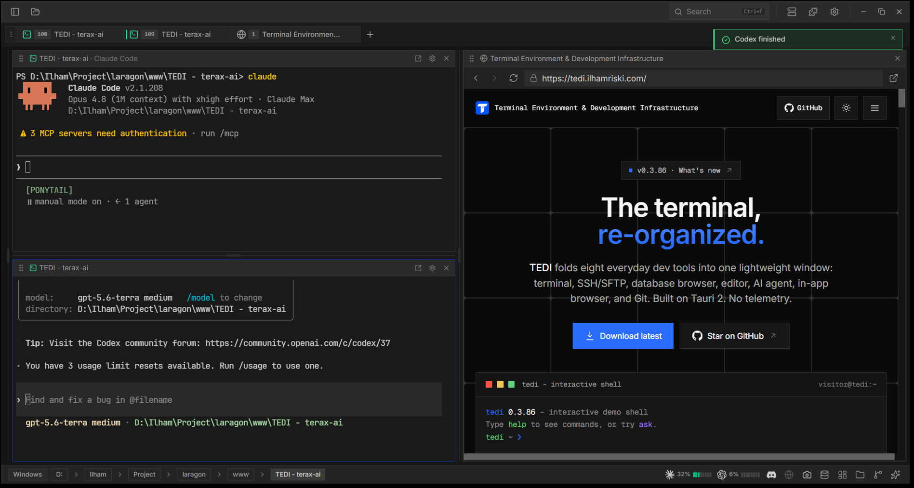
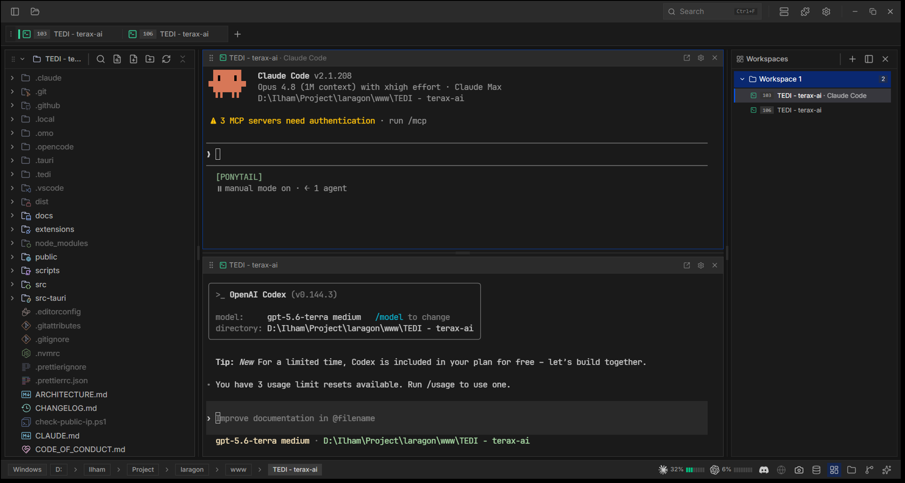
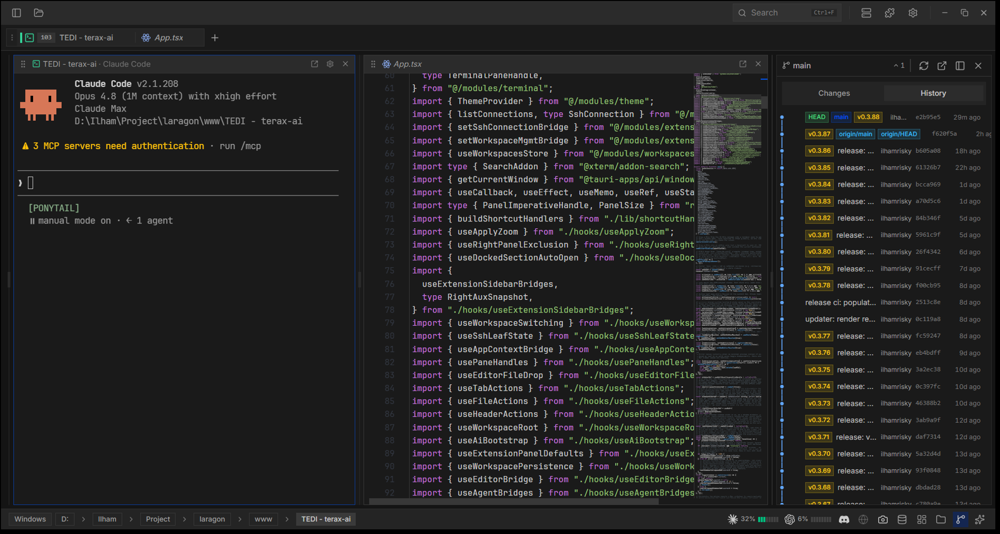
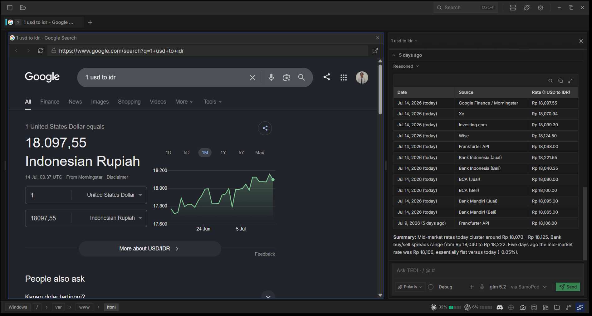
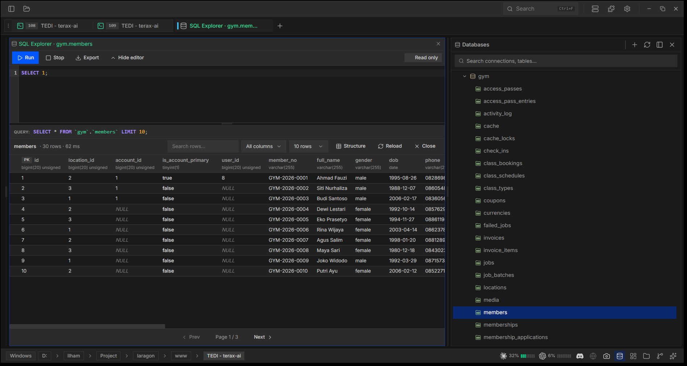

<div align="center">
  
  <h1>TEDI</h1>
  <p><em>Terminal Director</em></p>
  <p><strong>One lightweight app. Eight features. Your whole dev workflow in a single window.</strong></p>

  <p>
    
    
    
    
  </p>
</div>

---

## What is TEDI?

**TEDI** (Terminal Director) folds eight tools you reach for every day (a terminal, SSH client, DB browser, editor, AI agent, browser, and Git) into one window, so you stop alt-tabbing. Built on Tauri 2, so a Rust core owns every OS resource and the UI is a single webview: no Node runtime, no bundled Chromium, and a resident footprint closer to a terminal than to an IDE. **No telemetry**; API keys stay in the OS keychain, and it runs fully offline against a local model if you want.

## The eight features

| #   | Feature                         | What it does                                                                                                                                                                                                                     |
| --- | ------------------------------- | -------------------------------------------------------------------------------------------------------------------------------------------------------------------------------------------------------------------------------- |
| 1   | **Terminal multiplexer**        | Native PTY terminals (zsh / bash / fish / pwsh) on xterm.js + WebGL: split panes, tab groups, shell integration (OSC 7 / 133), inline search, and link detection. Inactive tabs keep streaming.                                  |
| 2   | **SSH connection**              | Connect to remote hosts (`russh`), open remote shells, and browse/transfer files over an integrated **SFTP** explorer, all from a saved connection manager.                                                                      |
| 3   | **SQL explorer** _(extension)_  | Browse and query databases from a dedicated panel. Ships as an extension (feature 8), so it installs and updates at runtime.                                                                                                     |
| 4   | **Code editor**                 | CodeMirror 6 for TS/JS, Rust, Python, PHP, HTML/CSS, JSON, Markdown, C/C++, Java, C#, SQL, and more, with inline AI autocomplete, diff view, Vim mode, and Markdown/image preview.                                               |
| 5   | **AI-native agent**             | Bring-your-own-key agent across ten providers (OpenAI, Anthropic, Google, xAI, Cerebras, Groq, DeepSeek, SumoPod) and **local models** via LM Studio or any OpenAI-compatible server (Ollama, llama.cpp, vLLM). Plan mode, skills, MCP, ten sub-agents, voice input, project memory via `TEDI.md`, and tools gated by approval. |
| 6   | **AI browser control**          | A real in-app browser (native webview) the agent drives end to end: navigate, read, type, click, scroll, screenshot the tab to _see_ it, and read its **console errors** to find out why your page broke.                        |
| 7   | **Workspaces**                  | Each workspace keeps its own project session (tab layout + working dirs) and switches instantly. The header folder picker spawns a terminal rooted there.                                                                        |
| 8   | **Source control + extensions** | Inline Git diff / SCM pane, and a first-class **extension** system: install from a `.zip` or GitHub release to add settings, AI tools, commands, keybindings, panels, and status / header / sidebar items.                       |

Everything is **fully themeable** (presets, custom colors, transparency) while staying lightweight.

## Install

Pre-built binaries: **[Releases](https://github.com/IlhamriSKY/TEDI/releases/latest)** (Windows, macOS, Linux `.deb` / `.rpm` / `.AppImage`). Download for your OS and install; TEDI auto-checks for updates.

## Screenshots

<p align="center">
  
  
</p>
<p align="center">
  
  
</p>
<p align="center">
  
</p>

## Configure AI

**Settings → AI**, pick a provider and paste your API key. Keys go to the OS keychain via `keyring`, never to disk or `localStorage`. Full list: `PROVIDERS` in [src/modules/ai/config.ts](src/modules/ai/config.ts).

**Running fully local?** Two routes, both keyless:

- **LM Studio** is its own provider. Start its server and point TEDI at it (default `http://localhost:1234/v1`).
- **OpenAI Compatible** takes any server that speaks the API, and you can add several at once. Presets ship for **Ollama** (`:11434`), **llama.cpp** (`:8080`), **vLLM** (`:8000`), plus OpenRouter and 9Router. A `localhost` / `127.0.0.1` endpoint needs no API key; leave the field blank.

The same providers back **inline autocomplete** (Settings → AI → Autocomplete), so ghost text works on a cloud key or entirely offline. Set the model id yourself when your server names models its own way (`qwen2.5-coder:7b`, a GGUF filename).

## Extensions

TEDI ships **no extensions** in the binary; every one (including the SQL explorer) installs at runtime. Re-installing the same `manifest.id` replaces the old copy, so the same path handles updates.

```
Settings → Extensions → From file       (pick a local .zip)
Settings → Extensions → From GitHub     (paste owner/repo)
Settings → Extensions → Check updates   (re-check releases/latest)
```

Per-extension icon, namespaced settings/secrets/storage, and a permission-gated host API. Authoring guide: [extensions/README.md](extensions/README.md). Reference extension: [Discord Rich Presence](https://github.com/IlhamriSKY/TEDI.discord-rich-presence).

## CLI

```bash
tedi [PATH]          # open a folder or file in TEDI
tedi .               # open the current directory
tedi ext <subcmd>    # manage extensions headlessly (install / list / update / ...)
tedi theme <subcmd>  # manage themes from the terminal
tedi --help | --version | --update
```

If TEDI is already running, the request forwards to the existing window (no second instance). On macOS / Linux AppImage the `tedi` command is not on `PATH` by default: **Settings → General → "Install `tedi` command in PATH"** creates a shim at `~/.local/bin/tedi`. Windows' installer handles this.

### Open with TEDI

Right-click a folder or file in the file manager and TEDI opens it, the same way `tedi <path>` does (forwarded to the running window if one is up). Registered by the installer on each platform, nothing to configure:

- **Windows**: "Open with TEDI" on folders, drives, folder backgrounds, and files. Windows 11 shows classic verbs under **Show more options** (or Shift+F10); top-level placement needs a packaged COM handler, the same limit VS Code's "Open with Code" has. Removed on uninstall.
- **macOS**: right-click → **Open With → TEDI**, and dropping a folder on the Dock icon. TEDI registers as an alternate handler, so it never takes over your default app.
- **Linux** (`.deb` / `.rpm`): right-click → **Open With → TEDI** in Nautilus, Dolphin, Thunar, Nemo. AppImage installs nothing system-wide, so integrate it yourself (e.g. AppImageLauncher) for the entry to appear.

## Architecture

A Tauri 2 app: a React 19 webview (`src/`) talks to a Rust backend (`src-tauri/`) via `invoke()` and streaming `Channel`s. See **[ARCHITECTURE.md](ARCHITECTURE.md)** for a one-page map, then [TEDI.md](TEDI.md) for the per-module reference.

## Build from source

Prereqs: Rust stable ([rustup](https://rustup.rs)), Node 20.19+ / 22.12+ with [pnpm](https://pnpm.io), and [Tauri's platform prereqs](https://tauri.app/start/prerequisites/).

```bash
pnpm install
pnpm tauri:dev     # dev (isolated data dir)
pnpm tauri build   # production bundle
```

Pre-PR checks (full list in [CONTRIBUTING.md](CONTRIBUTING.md)):

```bash
pnpm exec tsc --noEmit && pnpm lint:imports && pnpm format:check
cd src-tauri && cargo clippy && cargo fmt
```

## Notes per platform

- **Windows**: SmartScreen warns on first launch (unsigned); click _More info > Run anyway_. Shell priority: `pwsh.exe`, `powershell.exe`, `cmd.exe`.
- **Linux**: on `EGL_BAD_PARAMETER` or a blank window, set `WEBKIT_DISABLE_DMABUF_RENDERER=1`. AppImage needs FUSE (else `--appimage-extract-and-run`, or use the `.deb` / `.rpm`).
- **macOS**: minimum 10.15. Unsigned builds may trip Gatekeeper; drag to `/Applications`, run `xattr -cr /Applications/TEDI.app` once, then open from Finder.

## Credits

TEDI is a fork of **[crynta/terax-ai@v0.5.9](https://github.com/crynta/terax-ai/releases/tag/v0.5.9)** by [Crynta](https://github.com/crynta). The Tauri/Rust backend, the xterm.js terminal, the CodeMirror editor, and the AI agent pipeline are the work of Crynta and the Terax contributors. Same Apache-2.0 license; if TEDI is useful, please star upstream [Terax](https://github.com/crynta/terax-ai).

## License

Apache-2.0. See [LICENSE](LICENSE) and [NOTICE](NOTICE) for required attribution.
